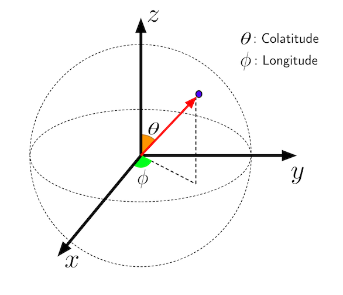
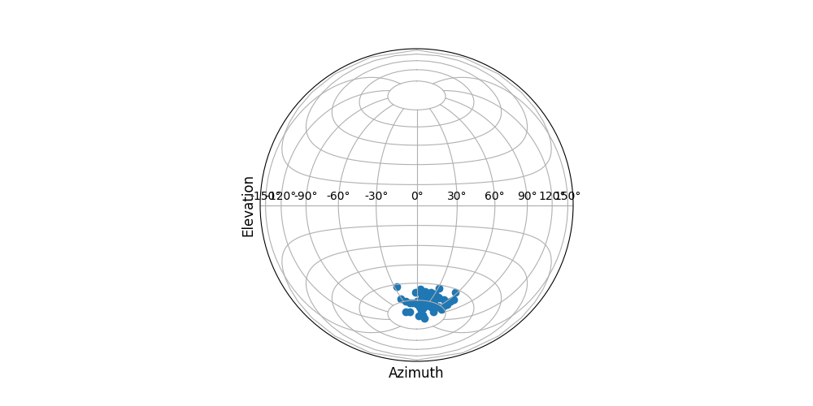
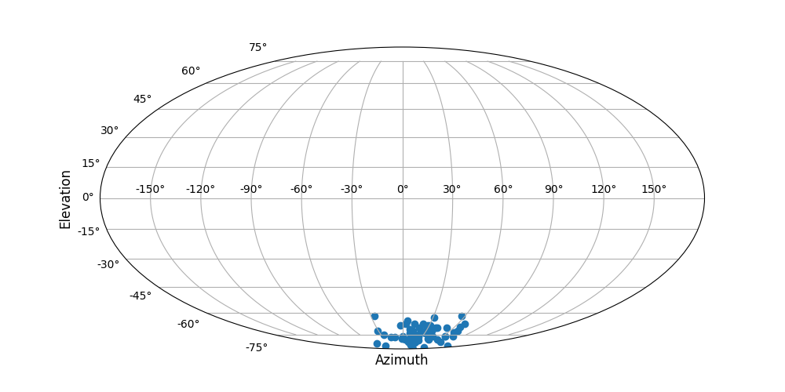
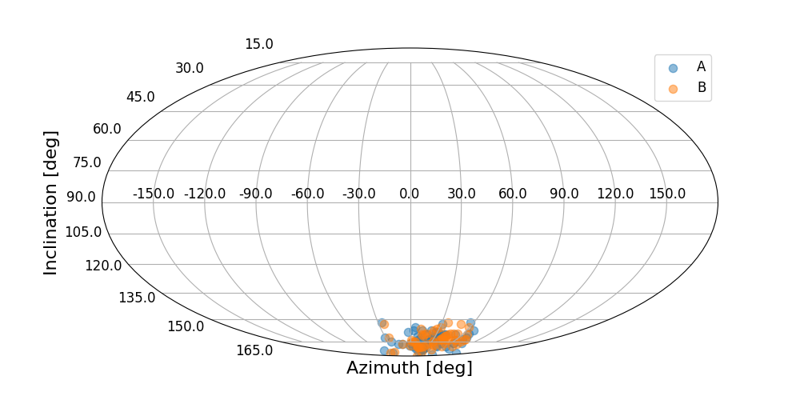
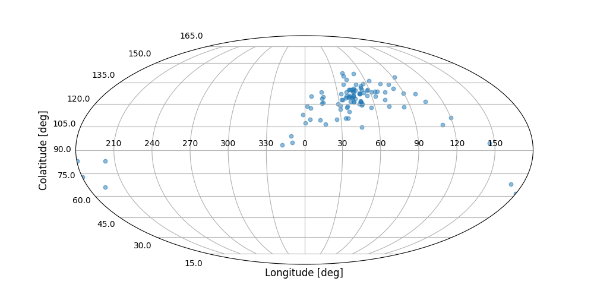
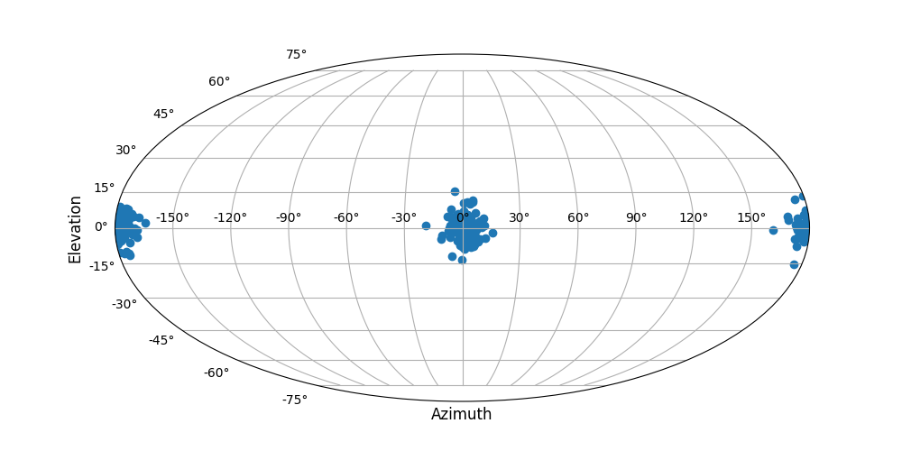

 [](https://sphstat.readthedocs.io/en/latest/?badge=latest) 

# **sphstat:** A Python 3 package for spherical statistics


## Description

Spherical data arises in many different fields of science. **sphstat** (pronouced **siff-stæt**)
provides the necessary tools to apply inferential statistics on 
data on the unit sphere. The package implements tests and algorithms for 
vectorial datagiven by Fisher, Lewis and Embleton [1]. Note that tests and 
methods for axial data have not yet been implemented as of version 1.0

## Author

- Huseyin Hacihabiboglu, [METU](https://metu.edu.tr) [Spatial Audio Research Group (SPARG)](https://www.sparglab.org), Ankara, Turkiye
- Github: [@hacihabiboglu](https://www.github.com/hacihabiboglu)
- E-mail: [hhuseyin@metu.edu.tr](mailto:hhuseyin@metu.edu.tr)

## Installation

### Option 1

```sphstat``` can be installed from PyPI using ```pip3```. In Terminal, type

```bash
  pip3 install sphstat
```

### Option 2

Alternatively you can download it from Github as a ZIP file or as a Git repository:

```bash
git clone https://github.com/metu-sparg/sphstat
cd PATH/TO/LOCAL/FOLDER
pip3 install .
```
Documentation is available at [https://sphstat.readthedocs.io/en/latest/](https://sphstat.readthedocs.io/en/latest/)

## Requirements

```sphstat``` was tested on an Apple M1 computer with Python 3.10. 
It is agnostic of the platform and will very likely work on Python 3.8 and above.

* ```numpy```
* ```scipy```
* ```sympy```
* ```openpyxl```
* ```pandas```
* ```matplotlib```

## Usage and examples

```sphstat``` implements 
includes several modules whose names are pretty self-explanatory. These are:

* ```descriptives```: Functions for descriptive statistics on spherical data
* ```distributions```: Functions for generating data from different spherical distributions
* ```singlesample```: Functions for single-sample tests on spherical data
* ```twosample```: Functions for inferential staticts on two or more samples
* ```modelling```: Functions for cross-correlation, regression, and temporal analysis
* ```utils```: Utility functions used by other modules

It is important to note that the default coordinate system used by ```sphstat``` is the 
polar coordinates. The colatitude angle ($theta$) is defined from the axis, $0$ (north 
pole) to $\pi/2$ (south pole) and the latitude angle is defined from $0$ (front direction) 
to $2\pi$. Figure shows the employed polar coordinate system.



A full documentation is available at **readthedocs**. 


The following examples demonstrate the usage of ```sphstat```.

### Importing ```sphstat```

After installation, ```sphstat``` is imported just like any other Python package by:

```python
import sphstat
```

### Reading and converting a sample

Presently only Excel files are accepted as input. Each worksheet should contain
a single sample. Data can either be in degrees or in radians. Data in three 
different spherical coordinate systems can be processed. The default system is
polar, but longitude/latitute (i.e. ```'lonlat'```) and declination/inclination
(i.e. ```'decinc'```) can also be handled. While some functions require data in
polar coordinates, some others will require a Cartesian representation. Necessary
conversions need to be made. The following example shows reading data in the second 
worksheet, represented in declination/inclination form (e.g. Dec. in first column 
and Inc. in the second) in radians and converted to first to polar coordinates and 
then to Cartesian form:

```python 
from utils import readsample, convert, polartocart
    
sample = readsample('/PATH/TO/DATA/mydata.xlsx', wsindex=1, typ='rad')
samplepol = convert(sample, 'decinc')
samplecart = polartocart(samplepol)
```

### Descriptive statistics of spherical data

The descriptive statistics of spherical data is obtained by using the ```resultants()``` 
function from 

```python
from descriptives import resultants
from utils import prettyprintdict

r = resultants(samplecart)
prettyprintdict(r)

Directional Cosines:  [ 0.22649571 -0.07068299  0.97144408]
Resultant Vector:  [ 8.0846443  -2.52299178 34.67518128]
Resultant Length:  35.694469568249374
Mean Direction:  (0.23955319922943338, -0.30249497353817606)
Mean Resultant Length:  0.9915130435624826
```

Another useful function is ```mediandir()``` which calculated the median direction 
as well as the parameters for (1-alpha)% confidence cone:

```python
from descriptives import mediandir

medi, ccone, success, W = mediandir(samplecart, ciflag=True, alpha=0.01)
```

### Plotting a sample

```sphstat``` uses either one of Mollweide or Lambert projections to display data.

```python
from plotting import plotdata

plotdata(sample,  proj='lambert')
plotdata(sample,  proj='mollweide')
```
will produce the following scatterplots, respectively.

**Lambert projection:**



**Mollweide projection:**



**Multiple data plot**

Two or more data can also be overlaid. ```plotdatalist()``` will produce the 
necessary legend for the scatterplot:

```python
from plotting import plotdatalist

samplelist = [sampleA, sampleB]
plotdatalist(samplelist, labels=['A', 'B'], proj='mollweide')
```



### Generating samples from spherical distributions

```sphstat.distributions``` provides functions that can generate vectors randomly 
drawn from uniform, Fisher, Kent and Watson distributions

```python
from sphstat.distributions import kent

mu0 = np.array([0., 1., 0.])
sample = kent(100, 50, 20, np.array([1., 1., 1.]), mu0)
samplerad = carttopolar(sample)
plotdata(samplerad, proj='mollweide')
```



```python
samplewatson = watson(100, lamb=0., mu=1., nu=0., kappa=50)
samplerad = carttopolar(samplewatson)
splt.plotdata(samplerad, proj='mollweide')
```



### Statistics on a single sample

```sphstat.singlesample``` contains different tests and parameter estimators for a single sample.
For example, testing whether a sample comes from a uniform distribution:

```python
from sphstat.singlesample import isuniform

res = isuniform(samplecart, alpha=0.05)
prettyprintdict(res)

teststat:  86.04615038397233
crange:  7.814727903251179
testresult:  False
```

...or Fisher distribution (which provides the results of three different tests for Fisherianness):

```python
from sphstat.singlesample import isfisher

res = isfisher(samplecart, alpha=0.05)
prettyprintdict(res)

colatitute:  {'stat': 0.9137353833832544, 'crange': 1.094, 'H0': True}
longitude:  {'stat': 1.5941243439349297, 'crange': 1.207, 'H0': False}
twovariable:  {'stat': 0.7669521350409133, 'crange': 0.895, 'H0': True}
H0:  False
alpha:  0.05
```

Parameter estimation functions output multiple values. For example, ```fisherparams()```
will output mean direction, concentration parameters, semi-vertical angle, and (1-alpha)% CI
for the concentration parameter:

```python
from sphstat.singlesample import fisherparams

mdir, kappa, thetaalpha, cikappa = fisherparams(samplecart, alpha=0.05)
```
There are also functions to test the sample statistics against hypothethical values. For example,
whether the population concentration parameter is a given value can be tested:

```python
from sphstat.singlesample import kappatest

res = kappatest(samplecart, kappa0 = 100)
prettyprintdict(res)

R:  30.765364522847698
cvaltup:  (32.781120236887155, 32.559979744967514)
testresult:  False
```

### Statistics on two or more samples

The tests and methods in ```sphstat.twosample``` provides tests and methods for the analysis
and comparison of multiple vectorial samples on the unit sphere. For example, in the following
example, three samples are tested for a common mean direction. 

```python
from sphstat.twosample import iscommonmean
from sphstat.utils import polartocart, convert

sample1rad = convert(sample1, 'decinc')
sample2rad = convert(sample2, 'decinc')
sample3rad = convert(sample3, 'decinc')
slist = [sample1rad, sample2rad, sample3rad] #, sample3, sample4]
slistcart = []
for s in slist:
    slistcart.append(polartocart(s))

res = iscommonmean(slistcart, alpha=0.05)
prettyprintdict(res)

Gr:  9.543041349403211
cval:  9.487729036781154
testresult:  False
```

There are also more specific tests if, for example, it is known that the underlying distributions
are Fisher, a multiple comparison akin to running multiple t-tests on linear data is given by

```python
from sphstat.twosample import isfishercommonmean

res = isfishercommonmean(slistcart)
prettyprintdict(res)

Z:  0.9921425881206186
z0:  0.992171530518573
res:  True
```

Similarly, a test similar to Levene's test for testing whether multiple samples have the same concentration
parameter is:

```python
from sphstat.twosample import isfishercommonkappa

res = isfishercommonkappa(slistcart)
prettyprintditc(res)

Z:  4.853124235595307
cval:  5.991464547107979
df:  2
testresult:  True
```

### Correlation, regression, temporal association

Functions in ```sphstat.modelling``` implement functionality to calculate correlations, regression and time-series 
analysis on spherical data. For example:

```python
from sphstat.modelling import xcorrrandomsamples

res = xcorrrandomsamples(sampcart1, sampcart2, 10000, htype='!=', alpha=0.05)
prettyprintdict(res)

rhohat:  0.8512942745968715
std:  0.03355675208163771
cval:  (-0.0661660798549282, -0.12290819705298231)
ci:  (0.7855242490787221, 0.9170643001150208)
testresult:  True
```
indicates that two samples are correlated with a correlation coefficient of $0.851$ with the 95% confidence interval also given.

In order to check if there is any serial association between time-ordered observations 
in a sample:

```python
from sphstat.modelling import isn

res = isnotseriallyassociated(sampcart, alpha=0.05)
prettyprintdict(res)

Sstar:  2.504563022268227
cval:  1.6448536269514722
testresult:  False
```
indicating that the observations are not serially associated at $\alpha=0.05$ level.


## Limitations

In its present version ```sphstat```...

- ...mostly works on larger (i.e. ```n >= 25```) sample sizes.
While some bootstrapped methods (e.g. jackknife and permutation tests) are implemented
not all are. 

- ...does not implement tests for axial and girdle data. A future version might include these tests

- ...only implements the tests and methods given in Fisher, Lewis and Embleton [1] which is the most
frequently used catalogue of tests and methods for spherical data. However, more recent methods
exist, such as those in Ley and Verdebout [2]. These methods are planned to be incorporated into a
future version.


## References
[1] Fisher, N. I., Lewis, T., & Embleton, B. J. (1993). Statistical analysis of spherical data. Cambridge University Press.

[2] Ley, C., & Verdebout, T. (2017). Modern directional statistics. Chapman and Hall/CRC.
